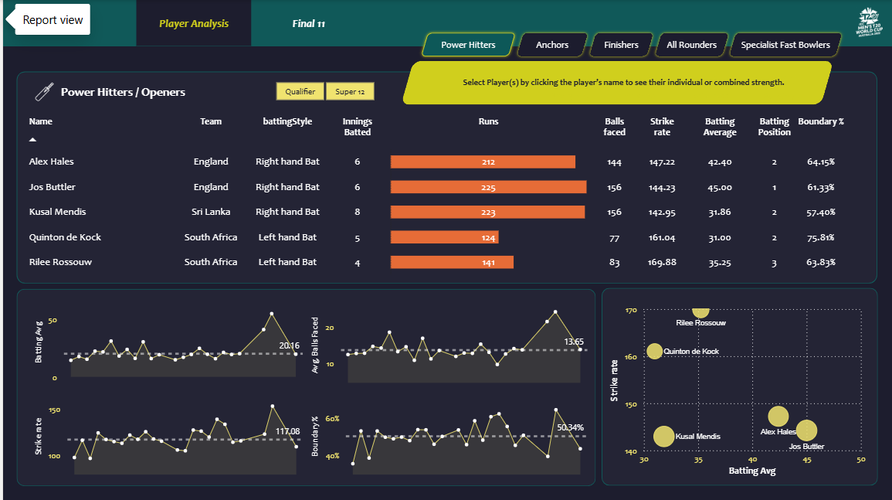

# 🏏 T20 World Cup 2022 – Cricket Player Analytics (Python + Power BI)

This project analyzes player performance from the **ICC T20 World Cup 2022** and identifies the **Top XI (Best Playing 11)** based on real match data.  
Data was transformed in **Python** and visualized in **Power BI** using advanced **DAX measures**.

---

## 🔧 Tech Stack
| Tool | Used For |
|------|----------|
| Python (Jupyter Notebook) | Data cleaning & transformation |
| Pandas | Aggregating, merging, formatting CSV files |
| Power BI | Data modeling, measures, dashboard |
| DAX | Calculated metrics (Strike Rate, Average, Boundary %, Economy, etc.) |

---

## 📂 Files Included

| File | Description |
|------|-------------|
| `batting.csv` | Transformed batting dataset (Python output) |
| `bowling.csv` | Transformed bowling dataset |
| `player.csv` | Player metadata (name, country, playing style) |
| `match.csv` | Match-level information |
| `DAX Measures.pbix` | Power BI dashboard & all DAX calculations |

> ✅ These files are all that is required to recreate the Power BI dashboard.

---

## 📊 DAX Metrics Used

**Batting Measures**
- `Total Runs`
- `Strike Rate`
- `Batting Average`
- `Boundary %`
- `Batting Position`

**Bowling Measures**
- `Wickets`
- `Economy`
- `Bowling Strike Rate`
- `Dot Ball %`

These statistical measures were used to evaluate and select the **Best XI players of the tournament**.

---

## 📸 Dashboard Preview

> The dashboard allows filtering by player role: **Power Hitters, Anchors, Finishers, All-Rounders, Specialist Bowlers**.

---

## 🚀 How to Use

1. Download / clone the repository.
2. Open `DAX Measures.pbix` in Power BI Desktop.
3. Ensure the CSV files are in the same folder path.
4. Make your own dashboard — select players to compare performance visually.

---

## ✅ Output

- Interactive dashboard that ranks players using performance metrics.
- Final selection of the **Top XI team** based purely on data.

---

### ⭐ If you find this project useful, please give this repo a star!

